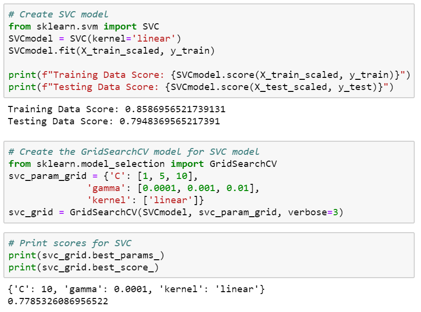

# Predicting Cannabis Users
## Final Project

**Dangerous with Data Group:**

* Orlando Carpio - Team Leader - Machine Learning
* Yuan Chai Data Visualizations
* Ruth Mary Jimenez - Data Processing

**Tableau Dashboard**

* [Tableau on Github](https://orlcar.github.io/drug-consumption-data-visualization/)
* [Tableau Public](https://public.tableau.com/profile/yuan6903#!/vizhome/CannabisConsumptionPredictionProject/Dashboard)

# Project Goals

* Our Team’s goal was to find the best machine learning model to predict cannabis users when looking at features such personality traits and demographics.
 
* Leverage machine learning methods to analyze relationships between each criterion and its likelihood of leading to drug usage.
 
* Find and apply the machine learning model with the most accurate prediction the data set and predict the potential risk of cannabis use.

# Defining the Workflow

* Gathering the Data
* Data Processing
* Data Visualization
* Researching the best model that works with out data
* Training and Testing the Model
* Evaluating the Model

# Data Gathering

* Find the Training/Testing Data Set
    * Source: "Drug consumption (quantified) Data Set" from the UCI Machine Learning Repository [Weblink]( https://archive.ics.uci.edu/ml/datasets/Drug+consumption+%28quantified%29)
   
* Find the Validation Data Set
    * National Survey on Drug Use and Health, 2017 (NSDUH-2017-DS0001) [Weblink](https://datafiles.samhsa.gov/study-dataset/national-survey-drug-use-and-health-2017-nsduh-2017-ds0001-nid17939)

# Data Processing

**Python Libraries**

* Pandas
* Numpy
* Warnings
* Tensorflow
* Sci-kit Learn
* Matplotlib
* Seaborn

**ETL**

[Jupyter Notebook](https://github.com/orlcar/drug-consumption-data-visualization/blob/master/Drug_Consumption_Project%20-%20ETL%20%26%20Plots.ipynb)

* Manipulate the quantified data. The data set we chose was already grouped into bins. One of the reasons for the binning is to force an even distribution of the values.
* Assign headers to the data. The headers were unknown; we referenced the UCI webpage where explanations for each feature were found, and assigned the column names and their order, accordingly.
* Extract the columns (features) that will be used with our machine learning model.
* Save a CSV copy of the filtered data to use with Tableau.
* Perform the same tasks to the Validation data set.

***

#  Data Visualization

**Pandas and Matplotlib**

After normalizing the data and selecting the relevant features, we proceeded to get the correlation between the selected features.
We created a correlation matrix or heatmap.

Using Gradient Boosting Classifier to see which features are important

Cannabis Users by Age. We used the Seaborn library with this plot.

The data shows young adults are the biggest group of cannabis users

Cannabis Users by Gender

Among the 2 genders, male users surpass female users. 

Analyzing drug consumption rate across Education Levels

Education or lack of education’s influence is minimal for cannabis use.

Violin Plot

What if combine Age and Education Level together? 

Focus only on the actual cannabis users.

Bring all the basic demographic features (Age, Gender, Education) together and create a pivot table.

There is definitely a relationship among 'Age', 'Gender', 'Education' and 'Drug Consumer’. We combined them together and visualize it.

***

# Modeling and Evaluation

**Prediction**

The target prediction is to determine if the selected features influence the use of cannabis among our data respondents.

Given the nature of our features after several modifications; as well as the problems we encountered along the way, a simple logistic regression algorithm was found to be the most effective model for our target prediction.

Logistic regression models are easily understood, and commonly used for the classification of problems with two possible outcomes.

**Data Evaluation Process:**

The original data set contained 1885 respondents. 1472 were considered users and 413 non-users.

Because the sample size of individuals who have not used cannabis is significantly smaller than sample size of cannabis users, upsampling is performed to make the sample sizes equal. We used a new library called resample.

## Resampling 

## SVC Model

## Logistic Regression Model

This model gave us the best result.

## Linear Regression Model

## Ridge Model

## ElasticNet Model

## Model Results Comparison

* Linear Regression
* Logistic Regression
* SVC
* Ridge
* ElasticNet

## Train Data vs Validation Data

* Deep Neural Network Train
* Loss: 0.3168505177549693
* Accuracy: 0.9270833134651184

* Deep Neural Network Test
* Loss: 0.5623318915781768
* Accuracy: 0.842391312122345

# Logistic Regression Results

# SVC Model Results

# Conclusion

We were able to make a decent logistic regression model for binary classification of cannabis users from the machine learning dataset. It appears to do a fair job identifying cannabis users correctly in the original dataset.

However, when applied to the validation test dataset, the model incorrectly labels a significant number of cannabis users as nonusers. 
The model does not appear reliable for identifying cannabis users on an individual basis. The model could be useful for classifying populations as potential targets for public health outreach.

# Challenges

**Data Processing**

We changed the data multiple types, too much time spent just doing that.
 
Finding validation data that would match the test/train data. Hours were spent researching it to little success, we had to randomize the personality traits to make it work.

**Modeling & Evaluating**

Due to all the changes to the data obtaining the models final scores took time.
