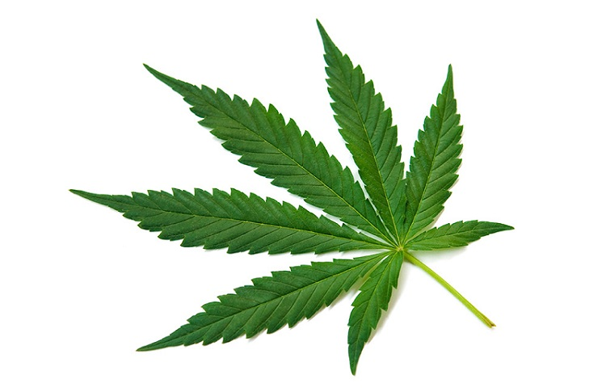

# Predicting Cannabis Use
## Final Project

**"Dangerous with Data" Group**

* Orlando Carpio - Team Leader - Machine Learning
* Yuan Chai Data - Visualizations
* Ruth Mary Jimenez - Data Processing

**Tableau Dashboard**

* [Tableau on Github](https://orlcar.github.io/drug-consumption-data-visualization/)
* [Tableau Public](https://public.tableau.com/profile/yuan6903#!/vizhome/CannabisConsumptionPredictionProject/Dashboard)

# Project Goals

* Find the best machine learning model to predict whether an individual is a cannabis user when looking at features such as personality traits and demographics.
 
* Leverage machine learning methods to analyze relationships between each criterion and its likelihood of leading to cannabis usage.

# Defining the Workflow

* Gathering the data
* Data processing
* Data visualization
* Researching the best model that works with our data
* Training and testing the model
* Evaluating the model

# Data Gathering

* Obtain a training/testing data set
    * Source: ["Drug consumption (quantified) Data Set" from the UCI Machine Learning Repository] (https://archive.ics.uci.edu/ml/datasets/Drug+consumption+%28quantified%29)
   
* Obtain a validation data set
    * [National Survey on Drug Use and Health, 2017 (NSDUH-2017-DS0001)] (https://datafiles.samhsa.gov/study-dataset/national-survey-drug-use-and-health-2017-nsduh-2017-ds0001-nid17939)

# Data Processing

**Python Libraries**

* Pandas
* Numpy
* Warnings
* Tensorflow
* Sci-kit Learn
* Matplotlib
* Scipy
* Pickle
* Seaborn

** Features for Machine Learning Analysis **
* Demographics: age, gender, education
* Personality Traits: neuroticism, extraversion, openness, agreeableness, conscientiousness, impulsiveness, sensation
* Drug: Cannabis

The country and ethnicity categroies were not chosen because for cannabis users, the country data was heavily skewed to "USA" and "UK", and the ethnicity data was heavily 
skewed to "White".

**ETL**

[Jupyter Notebook](https://github.com/orlcar/drug-consumption-data-visualization/blob/master/Drug_Consumption_Project%20-%20ETL%20%26%20Plots.ipynb)

* Manipulate the quantified data. The data set we chose was already grouped into bins. One of the reasons for the binning is to force an even distribution of the values.
* Assign headers to the data. The headers were unknown; we referenced the UCI webpage where explanations for each feature were found, and assigned the column names and their order, accordingly.
* Extract the columns (features) that will be used with our machine learning model.
* Save a CSV copy of the filtered data to use with Tableau.
* Perform the same tasks to the validation data set.

***

#  Data Visualization

**Pandas and Matplotlib**

### Correlation Matrix
After normalizing the data and selecting the relevant features, we proceeded to get the correlation between the selected features.
We created a correlation matrix as a heatmap.

### Gradient Boosting Classifier

We used Gradient Boosting Classifier to see which features are important.

### Cannabis Users by Age

We used the Seaborn library with this plot. The data shows young adults are the biggest group of cannabis users.

### Cannabis Users by Gender

Between the 2 genders, the number of male users surpass the number of female users. 

### Cannabis Consumption Rate across Education Levels

Looking at education levels, the majority of cannabis users attended college but did not get their degrees.

### Violin Plot

Although male cannabis users outnumber female cannabis users, there are more older female cannabis users than male cannabis users.

### Age and Education Levels for Cannabis Users

If we look at age and education levels of cannabis uers only, we can see that on average, the youngest cannabis users
have likely left school at age 18 or went to college and did not get their degrees.  The oldest cannabis users on average tend
to have doctorate degrees.

There are trends among "Age", "Gender", "Education" and "Cannabis Consumer". We combined the categories together to visualize the trends. Most cannabis users tend
to be male, young, and  have not finished high school or college.

***

# Modeling and Evaluation

**Prediction**

The objective is to determine if the selected features are associated with the likelihood of cannabis use among the data respondents, allowing the prediction of cannabis use based on the selected features.

Given the nature of our features after several modifications, a logistic regression algorithm was found to be the most effective model for our target prediction goal.

Logistic regression models are commonly used for the classification of problems with two possible outcomes.

**Data Evaluation Process**

The original data set contained 1885 respondents. 1472 were considered cannabis users and 413 cannabis non-users.

Because the sample size of individuals who have not used cannabis is significantly smaller than sample size of cannabis users, upsampling is performed to make the sample sizes equal. 
We used a python library called resample to perform the upsampling.

## Resampling 

## SVC Model

## Logistic Regression Model

This model gave us the best results for predicting cannabis use.

## Linear Regression Model

## Ridge Model

## ElasticNet Model

## Model Results Comparison

* Linear Regression
* Logistic Regression
* SVC
* Ridge
* ElasticNet

## Train Data vs Validation Data

* Deep Neural Network Train
* Loss: 0.3168505177549693
* Accuracy: 0.9270833134651184

* Deep Neural Network Test
* Loss: 0.5623318915781768
* Accuracy: 0.842391312122345

# Logistic Regression Model Results

# SVC Model Results

# Challenges During the Project

** Data Processing **

Finding data to use for validation that would match the features in the testing/training data was difficult. 
Hours were spent searching for a usable dataset to little success. We found only one dataset with demographic information that matched the testing/training data set. 
We had to randomize the personality traits to make that dataset usable for validation.

** Modeling & Evaluating **

Creating a usable deep learning neural network model was a difficult task. A lot of time was spent creating and testing deep neural network models, but the best model
had significant loss and overfitting when assessing the test sample data. There might not have been enough features or enough features strongly associated with
cannabis use to create a usuable deep neural network model.

In addition, during our investigation, we modified the data multiple times because we found during the machine learning model testing process that the data needed to 
be changed to allow machine learning analysis. We had to decide whether to use the original scaled data values or rescale the values ourselves. We also had to test 
which features would be used in the final machine learning models. A lot of time was spent testing different variations of the data set, and eventually we found that 
using all the originally planned features worked best for creating effective machine learning models.
 

# Conclusion

We were able to make a decent logistic regression model for binary classification of cannabis users from the machine learning dataset. It appears to do a fair job 
identifying cannabis users correctly in the original dataset.

However, when the model was applied to the validation test dataset, it incorrectly labels a significant number of cannabis users as individuals who do not consume cannabis. 
The model does not appear reliable for identifying cannabis users on an individual basis. The model could be useful for classifying populations as potential targets 
for public health outreach to preventative cannabis abuse or cannabis addiction rehabilitation.
